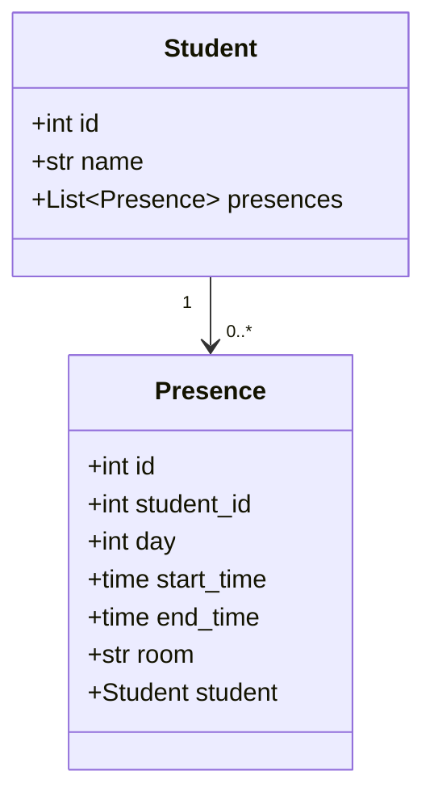
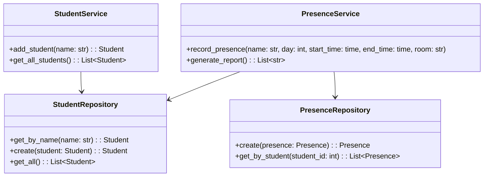
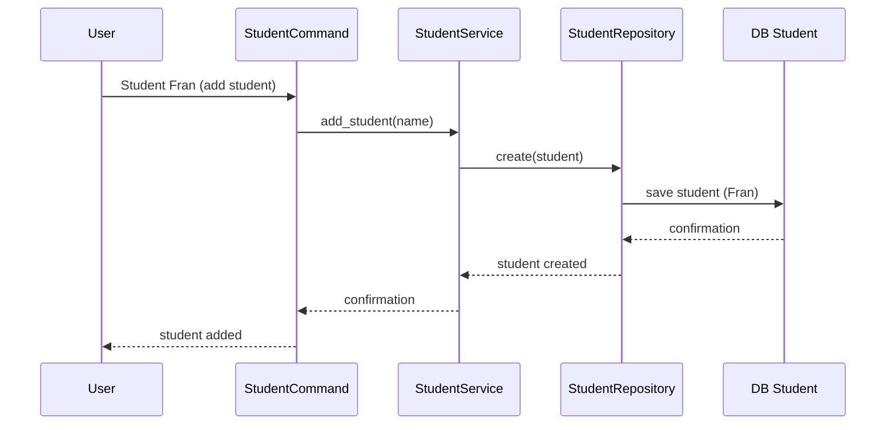
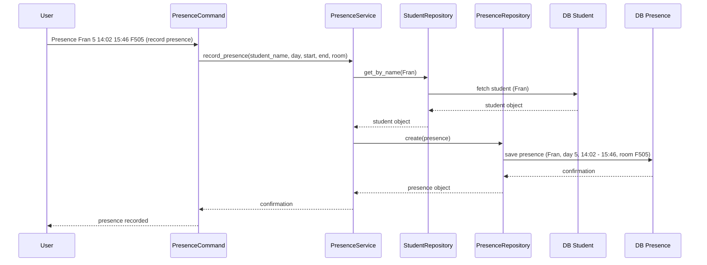
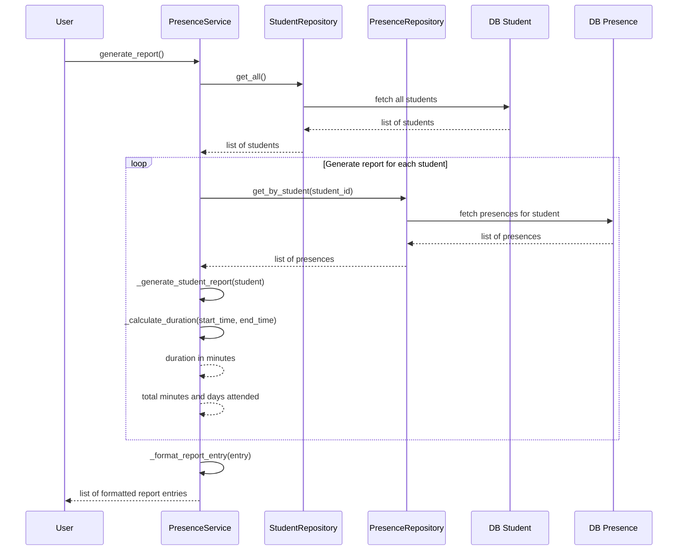

# Python student-attendance-manager App


This is a Python application created to manage and track student attendance at a university based on input commands. The app processes student registrations and class attendance records, and it generates a report of total time spent by each student at the university, as well as the number of days they attended.

## Problem Description

The goal is to track student presence based on the following commands:

1. **Student Registration**: The command `Student <name>` registers a student.
   - Example: `Student Matthias`
2. **Attendance Record**: The command `Presence <name> <day> <start_time> <end_time> <room>` records the attendance of a student.
   - Example: `Presence Matthias 2 09:04 10:35 F100` means Matthias was in room F100 on Tuesday from 9:04 to 10:35.
   - Only records of more than 5 minutes are considered valid.

### Output

The app generates a report listing each student’s total minutes of attendance and the number of days attended, sorted by total minutes in descending order.

**Example input:**

```
Student Marco
Student David
Student Fran
Presence Marco 1 09:02 10:17 R100
Presence Marco 3 10:58 12:05 R205
Presence David 5 14:02 15:46 F505
```

**Example output:**

```
Marco: 142 minutes in 2 days
David: 104 minutes in 1 day
Fran: 0 minutes
```

## Setup student-attendance-manager

### Requirements

- Python 3.9
- Poetry 1.8.3

### Project Dependencies

This project relies on the following dependencies:

- **Python 3.9**: The project uses Python 3.9 as the main language for development due to its stability and compatibility with many libraries.
- **SQLAlchemy**: Used for better management of database-related operations. SQLAlchemy provides an ORM (Object-Relational Mapping), which allows us to map Python classes to database tables, making it easier to handle CRUD operations. It also abstracts the SQL layer, improving code readability and maintainability.
- **SQLite**: A lightweight database used in this project for ease of development and maintenance. It’s an embedded database that doesn’t require a separate server, making it ideal for quick testing and small-scale applications.
- **Alembic**: A database migration tool used to manage changes to the database schema. Since we are using a database, it’s important to maintain ordered and consistent schema migrations as the project evolves. Alembic ensures that database schema updates are tracked and applied correctly.
- **Marshmallow**: A serialization/deserialization library used for data validation and object serialization. Marshmallow helps define schemas for our data models, ensuring that data input/output is validated before being processed, making the system more robust and less error-prone.
- **Pytest**: A framework used for writing and executing tests. Pytest makes it easy to write simple and scalable test cases, ensuring the correctness of the application as it grows.

### Installation

To install dependencies and set up the environment, run:

```bash
# Install dependencies
poetry install
```

## Usage

### Running the Application

You can run the application with a text file input as follows:

```bash
# Activate the virtual environment and open a shell inside it
poetry shell

# Execute the app with the input file (e.g., input.txt)
python main.py input.txt
```

### Running the App with Docker

Alternatively, you can use Docker to run the app:

```bash
# Build the Docker image
docker build -t student-attendance-manager .

# Run the app with the input file (e.g., input.txt)
docker run student-attendance-manager input.txt
```

## Testing

The application includes unit tests to verify functionality. Testing is done using **pytest**.

### Running Tests

```bash
# Install dependencies
poetry install

# Run the tests using pytest
poetry run pytest

# Alternatively, inside the Poetry shell
poetry shell

pytest
```

## Code Structure and Design

This section explains the structure of the project, including the class definitions and the flow of interactions between different components.

### Class Diagram



### Service and Repository Structure



### Sequence Diagram

**Add Student**



**Record Presence**



**Generate final report**



## Design Decisions

In this project, I opted for a clean and modular design by using services, repositories, and the command pattern for the following reasons:

1. **Separation of Concerns**: By using services for business logic, repositories for database interaction, and commands (Our entrypoint) for user actions, the code remains clean and easy to maintain.

2. **Extensibility**: New features can be added easily (e.g., new commands or database changes) without modifying existing code.

3. **Testing**: Having services, repositories, and commands separated allows for easier mocking and unit testing of individual components.

4. **Command Pattern Implementation**: The project implements the command pattern using a factory, which provides several benefits:

   - Encapsulation of Requests: Each command (StudentCommand, PresenceCommand) encapsulates a specific action, making it easy to add new commands without changing existing code.
   - Flexibility: The CommandFactory allows for dynamic selection of commands at runtime based on user input.
   - Decoupling: The command pattern decouples the object that invokes the operation from the object that performs the operation, improving modularity.
   - Extensibility: New commands can be easily added by creating a new command class and registering it with the CommandFactory.

### Testing Strategy

Tests focus on both unit testing the logic of the services and integration testing to ensure that the commands are parsed correctly, and results are generated as expected. The test suite ensures proper validation of input, correct calculation of attendance, and valid reporting.

## Contact Us
- Ramon Ignacio Colmenares Blanco - ramon.colmenaresblanco@gmail.com

## License
This project is licensed under the MIT License.
